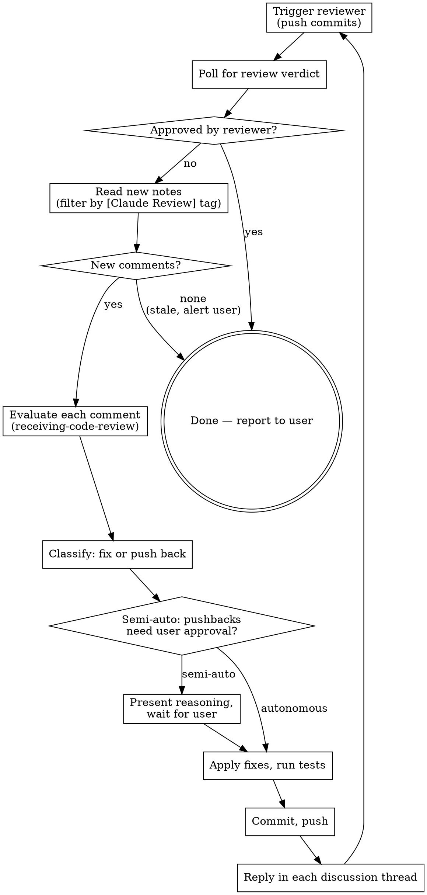

# GitLab Review Loop

Iterate on a GitLab merge request with an automated code reviewer bot until no new comments are raised. Two modes: autonomous (agent decides everything) and semi-automatic (user approves pushbacks).

**REQUIRED SUB-SKILL:** Use superpowers:receiving-code-review for evaluating each comment.

## When to Use

- MR is open and ready for automated review
- User wants reviewer-bot feedback addressed systematically
- After implementation is complete and pushed

## Reviewer Identification

**THE MAIN FILTER IS THE `[Claude Review]` TAG IN THE NOTE BODY — NOT THE USERNAME.**

Every review comment from this bot starts with the visible tag prefix `**[Claude Review]**` (configurable via `review.visible_tag_prefix` in `config.toml`). Filter by substring match on the note body — this is robust across:

- Renamed/rotated bot accounts (token rotation, multi-tenant setups)
- Comments posted as a regular human user that happen to be on the MR
- Same bot account commenting in multiple capacities

Username (`claude-reviewer` by default) is a secondary signal — useful for sanity checks, not as the primary filter.

Set once:
```bash
REVIEW_TAG="[Claude Review]"        # the only thing that matters — tag in note body
PROJECT="group/subgroup/project"    # group/path or numeric ID
MR=249                              # MR iid
```

Trigger for this project's bot: push commits — the daemon polls and re-reviews on new SHAs.

## Mode Selection

Ask user which mode before starting (unless they already specified):

**Autonomous:** Fix valid comments, push back on invalid ones with technical reasoning, iterate until clean. No user input between rounds. Use when: user trusts your judgment, wants hands-off iteration.

**Semi-automatic:** Fix valid comments automatically. When you want to push back or disregard a comment, present your reasoning to the user and wait for approval. Use when: user wants oversight on pushback decisions, unfamiliar codebase.

## The Loop



## Comment Evaluation

For each new note, BEFORE deciding to fix or push back:

1. **Read the actual code** the comment references (`position.new_path` + `position.new_line` for diff notes)
2. **Verify the claim** — is it technically correct for this codebase/stack version?
3. **Check if already addressed** — did a previous fix resolve this?
4. **Classify:**
   - **Fix:** Comment is valid, addresses a real issue
   - **Push back:** Comment is wrong, based on outdated assumptions, or out of scope
   - **Acknowledge:** Valid observation but intentionally out of scope — explain why

Common bot false positives (verify before accepting):
- Wrong library/SDK versions (outdated artifact names, deprecated symbols)
- Package paths that changed between major versions
- Suggesting patterns from older framework versions
- Flagging intentional design decisions as bugs
- For iOS/Android: confusing platform-specific idioms

## Commands

URL-encode `PROJECT` if it contains slashes (`group/subgroup/project` → `group%2Fsubgroup%2Fproject`). The `glab api` placeholder `:fullpath` does this automatically when you run inside the cloned repo.

```bash
REVIEW_TAG="[Claude Review]"
PROJECT_ENC=$(printf '%s' "$PROJECT" | jq -sRr @uri)
MR=249

# List discussions (groups of notes) — JSON
glab api --paginate "projects/$PROJECT_ENC/merge_requests/$MR/discussions" \
  > /tmp/discussions.json

# Extract review notes since LAST_NOTE_ID — filter by tag substring in body
LAST_NOTE_ID=0  # set to highest seen from previous round
jq -r --arg tag "$REVIEW_TAG" --argjson last "$LAST_NOTE_ID" '
  .[] | .id as $disc | .notes[]
  | select((.body | contains($tag)) and .id > $last and .system == false)
  | "\(.id) | \($disc) | \(.position.new_path // "general"):\(.position.new_line // "-") | \(.body)\n---"
' /tmp/discussions.json

# Reply to a specific discussion thread
glab api -X POST "projects/$PROJECT_ENC/merge_requests/$MR/discussions/$DISCUSSION_ID/notes" \
  -f body="Reply text"

# Resolve a discussion (after fix is pushed). `glab mr note resolve` exists
# in modern glab (verified in 1.92.1) but is marked EXPERIMENTAL — older
# versions don't have it. Probe once at startup, then dispatch:
if glab mr note resolve --help > /dev/null 2>&1; then
  RESOLVE_VIA="subcommand"
else
  RESOLVE_VIA="api"
fi

resolve_discussion() {
  local disc="$1"
  if [[ "$RESOLVE_VIA" == "subcommand" ]]; then
    glab mr note resolve "$MR" "$disc"
  else
    glab api -X PUT "projects/$PROJECT_ENC/merge_requests/$MR/discussions/$disc" \
      -f resolved=true > /dev/null
  fi
}

resolve_discussion "$DISCUSSION_ID"

# Trigger a new review round: push commits — daemon picks up the new SHA
git push

# Check if reviewer has approved (alternative completion signal)
glab api "projects/$PROJECT_ENC/merge_requests/$MR/approvals" \
  | jq -r '.approved_by[].user.username'
# → if BOT_USERNAME (e.g. "claude-reviewer") appears in the list, reviewer approved → done
```

## Completion Signals — Two Ways to Be Done

The loop terminates on EITHER of these:

1. **Reviewer approved the MR** (preferred positive signal). The reviewer adds itself to `approved_by` only when it has no remaining concerns. This is an explicit "LGTM" — no need to interpret silence.
2. **No new tagged notes after the latest push** (fallback). If the bot doesn't approve but also has nothing new to say, treat as done after timeout — alert the user that approval is missing.

**Always check approval first** — it's the cleanest signal. Only fall through to the "no new notes" check if the reviewer hasn't approved.

```bash
# Check approval — true if BOT_USERNAME is in approved_by
is_approved() {
  glab api "projects/$PROJECT_ENC/merge_requests/$MR/approvals" \
    | jq -e --arg bot "$BOT_USERNAME" \
        '.approved_by | map(.user.username) | index($bot) != null' \
    > /dev/null
}
```

Set `BOT_USERNAME` once for the approval check (in addition to `REVIEW_TAG` for the comment filter):
```bash
BOT_USERNAME="claude-reviewer"   # used ONLY for approval check
REVIEW_TAG="[Claude Review]"     # used for filtering review notes
```

## Polling for Review

**Use a background Bash poll loop, NOT CronCreate.** CronCreate only fires when the REPL is idle — if the user sends any message, the cron is suppressed. A background Bash task is reliable.

```bash
BOT_USERNAME="claude-reviewer"
REVIEW_TAG="[Claude Review]"
PROJECT_ENC=$(printf '%s' "$PROJECT" | jq -sRr @uri)
MR=249
LAST_NOTE_ID=${LAST_NOTE_ID:-0}

is_approved() {
  glab api "projects/$PROJECT_ENC/merge_requests/$MR/approvals" \
    | jq -e --arg bot "$BOT_USERNAME" \
        '.approved_by | map(.user.username) | index($bot) != null' \
    > /dev/null
}

count_new() {
  glab api --paginate "projects/$PROJECT_ENC/merge_requests/$MR/discussions" \
    | jq --arg tag "$REVIEW_TAG" --argjson last "$LAST_NOTE_ID" '
        [.[] | .notes[]
         | select((.body | contains($tag)) and .id > $last and .system == false)
        ] | length'
}

# Poll every 30s, up to 20 iterations (10 minutes total)
for i in $(seq 1 20); do
  sleep 30
  if is_approved; then
    echo "APPROVED — review loop complete"
    exit 0
  fi
  N=$(count_new)
  if [ "$N" -gt 0 ]; then
    # Wait 10s for inline diff notes to finish posting (they lag behind summary)
    sleep 10
    N=$(count_new)
    echo "REVIEW_ARRIVED new_notes=$N"
    exit 0
  fi
done
echo "TIMEOUT after 10 minutes — no approval, no new notes"
```

Key details:
- **Use `run_in_background: true`** on the Bash tool — you'll be notified when it completes
- **Wait 10s after first new note appears** before reading all comments — bots post a summary first, then inline diff notes arrive over several seconds. Reading immediately causes missed comments.
- **Timeout after 10 minutes** — alert the user if review doesn't arrive
- **Some bots take longer** (large diffs, queued workloads) — extend timeout if you know it
- **glab pagination:** `--paginate` streams pages correctly. Don't combine with `--jq length` — aggregate AFTER paginating, as in the snippet above

## Reply Patterns

Follow superpowers:receiving-code-review — no performative agreement.

**Fixed:** `"Fixed in {sha}. {Brief description of what changed}."` — then resolve the thread.

**Push back:** `"{Technical reasoning}. {Evidence — build output, dependency tree, docs reference}."` — leave thread unresolved for human to confirm.

**Acknowledged (out of scope):** `"Intentional for current scope. {Why}. Noted for future work."` — leave thread unresolved.

## Tracking State

Track the highest `note.id` seen after each round. New comments = `id > last_seen`. This avoids re-processing old comments across rounds. Note IDs are globally monotonic in GitLab, so a single integer is enough.

```
Round 1: trigger → poll → read (last_id=0)         → 7 notes  → fix/pushback → reply → push
Round 2: trigger → poll → read (last_id=412998031) → 3 notes  → fix/pushback → reply → push
Round 3: trigger → poll → read (last_id=413009445) → 0 notes  → done
```

After each round, persist:
```bash
LAST_NOTE_ID=$(jq --arg tag "$REVIEW_TAG" '
  [.[] | .notes[] | select(.body | contains($tag)) | .id] | max // 0
' /tmp/discussions.json)
```

## Completion Report

State explicitly which signal terminated the loop:

**Approved (preferred):**
```
GitLab review loop complete after N rounds on MR !{iid}.
Reviewer ({BOT_USERNAME}) APPROVED the MR.

Round 1: X notes (Y fixed, Z pushed back)
Round 2: ...
Total: X fixes applied, Y pushbacks, Z acknowledged.

MR is ready for human review.
```

**No new comments, no approval (fallback):**
```
GitLab review loop terminated after N rounds on MR !{iid}.
Reviewer did NOT approve, but produced no new notes after the latest push.

Round 1: ...
Total: ...

⚠️ Approval missing — recommend pinging the reviewer or human-reviewing manually.
```

## Common Mistakes

| Mistake | Fix |
|---------|-----|
| Fixing without verifying | Always read the actual code at `position.new_path:new_line` and check the claim first |
| Accepting wrong version advice | Bots often use outdated package names/imports — verify against actual dependency tree |
| Replying before pushing | Commit and push fixes BEFORE replying so SHAs in replies are real |
| Replying at MR-level instead of in thread | Use `discussions/$DISC_ID/notes`, not `glab mr note "$MR"` — that creates a new general note |
| Missing the URL-encoded project path | `glab api` raw paths need `group%2Fsub%2Frepo`; use `jq -sRr @uri` or run inside the repo to use `:fullpath` |
| Forgetting to re-trigger | After fixing + replying, push commits OR post `/review` to start the next round |
| Polling without timeout | Set a reasonable max wait (10 minutes) before alerting user |
| Using CronCreate for polling | CronCreate only fires when REPL is idle — use background Bash poll loop instead |
| Reading notes immediately after first appears | Inline diff notes lag behind the summary — wait 10s after first note shows up |
| Tracking by `created_at` | Multiple notes can share a timestamp; track by monotonic `note.id` |
| Resolving threads on pushbacks | Only resolve threads where you actually fixed the issue — leave pushbacks open for humans |
| Filtering by username instead of tag | The bot account can rotate or be reused — filter by `[Claude Review]` substring in note body, that's the stable signal |
| Including system notes | System notes (`"system": true`) are activity logs (assignment changes, label edits) — exclude them |
| Treating "no new comments" as success without checking approval | Reviewer might still be processing or might have concerns it didn't post yet. Always check `approvals` API first — only treat silence as done after timeout, with a warning |
| Forgetting that approval can be revoked on push | Some GitLab projects have `reset_approvals_on_push=true`. After every push, re-check approval — don't trust a stale "approved" flag from before the push |
